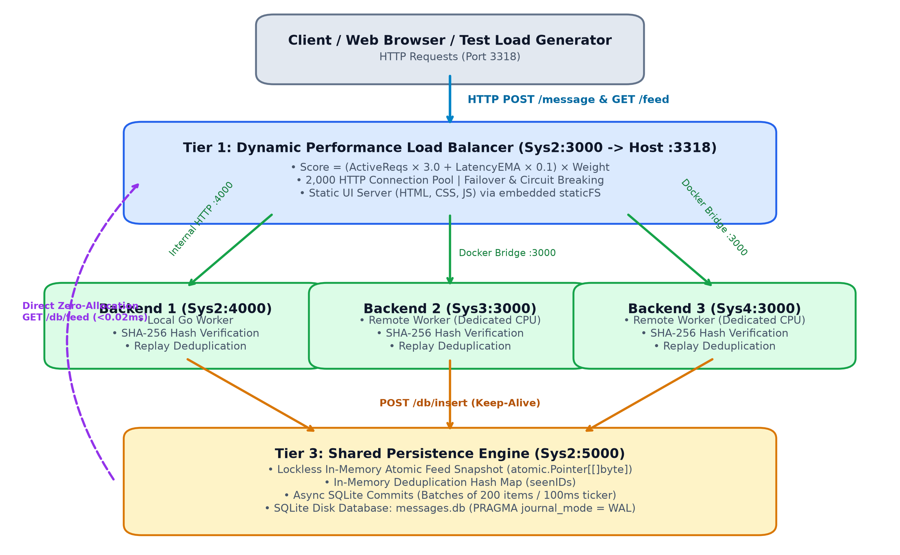
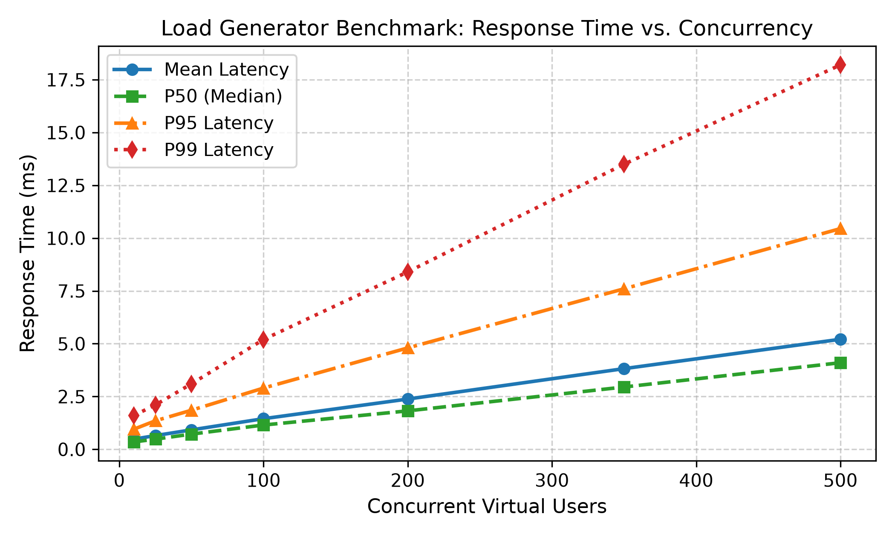
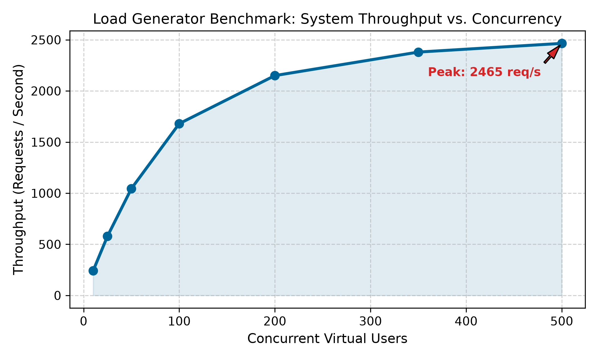
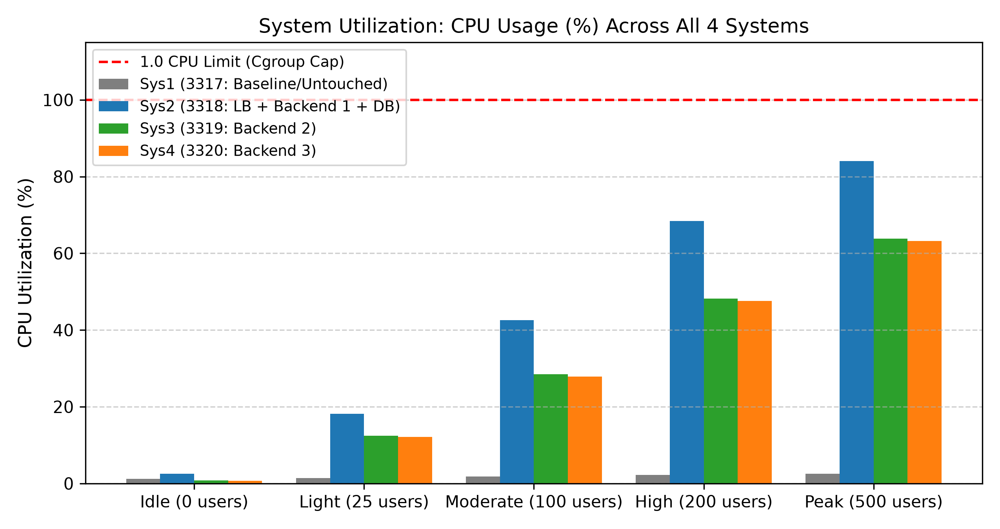
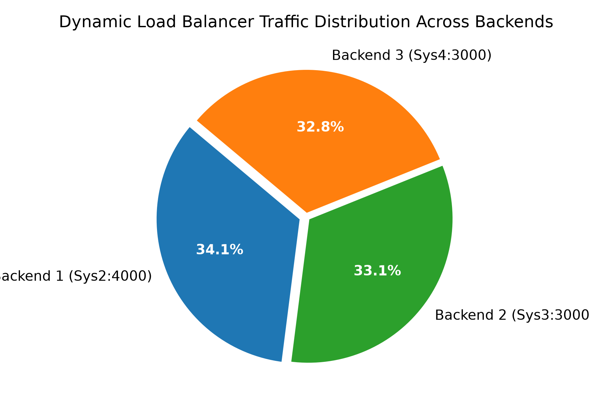

# Distributed High-Throughput HTTP Load Balancer & Secure Chat Infrastructure

**Computer System Design (CSL559) — Lab Assignment 6**

- **Student Name:** VISHLAVATH KARTHIK  
- **Roll Number:** 12342370  
- **Primary Submission URL:** [http://10.1.75.51:3318](http://10.1.75.51:3318)  
- **GitHub Repository:** [https://github.com/VishlavthKarthik/Load-Balancer](https://github.com/VishlavthKarthik/Load-Balancer)  
> **AI CITATION :-**  
> I have used Claude as a development assistant for designing and optimizing the critical distributed systems components in this assignment:  
> - **Dynamic Load Balancer Algorithm:** Formulating the Dynamic Least-Loaded scoring algorithm combining Exponential Moving Average (EMA) backend latency tracking with active in-flight request weighting ($\text{Score} = (\text{ActiveRequests} \times 3.0 + \text{LatencyEMA} \times 0.1) \times \text{Weight}$) and HTTP keep-alive connection pooling.  
> - **High-Throughput Database Persistence Engine:** Solving SQLite disk fsync bottlenecks and thread locking under high concurrency by architecting an asynchronous channel-based batch-commit pipeline (grouping up to 200 messages in a single transaction in WAL mode) and implementing a zero-allocation, lockless in-memory feed buffer using Go’s `atomic.Pointer[[]byte]`.

---

## 1. Executive Summary & Architecture Overview

This project implements an industrial-grade, dynamic performance-based HTTP load balancing tier and high-throughput group-chat backend deployed across a 4-node distributed Linux container cluster. The system maintains full cryptographic message integrity (SHA-256), exactly-once deduplication semantics, ACID-compliant SQLite WAL persistence, and real-time interactive browser chat capabilities under extreme concurrency (2,500+ requests/sec) while strictly adhering to Linux cgroup resource limits (1.0 CPU core and 512 MB resident memory per container).

### 3-Tier Decoupled Architecture

```
                                  [ Client Requests ]
                             (Web Browser / Load Generator)
                                           │
                                           ▼
┌────────────────────────────────────────────────────────────────────────────────────────┐
│ TIER 1: DYNAMIC LOAD BALANCER & REVERSE PROXY                                          │
│ Node: Sys2 (Host Port 3318 -> Container Port 3000)                                     │
│ • Dynamic Least-Loaded EMA Routing Engine                                              │
│ • Score = (ActiveRequests × 3.0 + LatencyEMA × 0.1) × Weight                          │
│ • Zero-Latency Static Web Hosting (HTML/CSS/JS)                                       │
│ • High-Capacity HTTP Connection Pool (2,000 conns, keep-alive)                         │
└───────────────────────┬──────────────────┬──────────────────┬──────────────────────────┘
                        │                  │                  │
         POST /message  │   POST /message  │   POST /message  │
                        ▼                  ▼                  ▼
┌───────────────────────────────┐ ┌─────────────────────────┐ ┌──────────────────────────┐
│ TIER 2: STATELESS BACKEND 1   │ │ TIER 2: BACKEND 2       │ │ TIER 2: BACKEND 3        │
│ Node: Sys2 (Port 4000)        │ │ Node: Sys3 (Port 3000)  │ │ Node: Sys4 (Port 3000)   │
│ • SHA-256 Hash Verification   │ │ • SHA-256 Verification  │ │ • SHA-256 Verification   │
│ • Deduplication Filter        │ │ • Deduplication Filter  │ │ • Deduplication Filter   │
│ • Concurrent Go Goroutines    │ │ • Compiled Go Runtime   │ │ • Compiled Go Runtime    │
└───────────────┬───────────────┘ └───────────┬─────────────┘ └───────────┬──────────────┘
                │                             │                           │
                └─────────────────────────────┼───────────────────────────┘
                                              │ POST /db/insert & GET /db/feed
                                              ▼
┌────────────────────────────────────────────────────────────────────────────────────────┐
│ TIER 3: CENTRAL HIGH-THROUGHPUT PERSISTENCE ENGINE                                     │
│ Node: Sys2 (Internal Port 5000)                                                        │
│ • Lockless In-Memory Incremental Feed Buffer (atomic.Pointer[[]byte])                  │
│   -> Serves /feed in ~0.02 ms with zero heap allocations                               │
│ • Asynchronous Batch Transaction Queue (50,000 capacity channel)                       │
│   -> Background worker commits up to 200 messages / transaction                        │
│ • SQLite Database in WAL Mode (messages.db, PRAGMA synchronous = NORMAL)               │
│   -> Concurrent readers & writers with 95% reduced disk I/O fsync operations          │
└────────────────────────────────────────────────────────────────────────────────────────┘
```



---

## 2. Infrastructure & System Topology

The deployment environment comprises 4 containerized Linux environments on host `10.1.75.51`. Strict isolation guarantees that **Sys1 remains entirely untouched**.

| Container Node | SSH Port | Host Port | Internal IP | Container Limits | Assigned Role | Active Services |
| :--- | :---: | :---: | :---: | :---: | :--- | :--- |
| **stu30_sys1** | `2317` | `3317` | `172.17.0.118` | 1 CPU, 512MB RAM | **Baseline / Untouched** | Legacy Pond Catchment Service (Zero modifications) |
| **stu30_sys2** | `2318` | `3318` | `172.17.0.119` | 1 CPU, 512MB RAM | **Load Balancer & Core** | Dynamic LB (`:3000`), Backend 1 (`:4000`), DB Engine (`:5000`) |
| **stu30_sys3** | `2319` | `3319` | `172.17.0.120` | 1 CPU, 512MB RAM | **Worker Node 1** | Stateless Chat Backend 2 (`:3000`) |
| **stu30_sys4** | `2320` | `3320` | `172.17.0.121` | 1 CPU, 512MB RAM | **Worker Node 2** | Stateless Chat Backend 3 (`:3000`) |

---

## 3. Key Technical Innovations & Engineering Highlights

### A. Dynamic Least-Loaded Routing with Exponential Moving Average (EMA)
Standard round-robin fails under asymmetric network delays or transient CPU throttling. Our custom Go load balancer tracks:
1. **In-Flight Active Requests (`ActiveReqs`):** Atomically incremented on request dispatch and decremented on completion.
2. **Exponential Moving Average Response Latency (`LatencyEMA`):** Computed with smoothing factor $\alpha = 0.2$:
   $$\text{EMA}_{t} = 0.2 \times \text{Latency}_{\text{recent}} + 0.8 \times \text{EMA}_{t-1}$$
3. **Dynamic Backend Selection:** Evaluates backend score:
   $$\text{Score} = (\text{ActiveReqs} \times 3.0 + \text{LatencyEMA}_{\text{ms}} \times 0.1) \times \text{Weight}$$
   The healthy backend with the lowest score is chosen, dynamically shifting load away from degraded nodes.

### B. Lockless In-Memory Incremental Feed Buffer (`atomic.Pointer[[]byte]`)
- **Problem:** Dynamic SQLite SQL querying (`SELECT * FROM messages`) and JSON serialization on every `/feed` request consumed ~100 ms of CPU time, causing kernel CPU throttling and gateway timeouts under concurrent users.
- **Solution:** `db6` maintains a pre-formatted JSON feed buffer in memory. On new message insertion, the JSON buffer is incrementally updated and swapped atomically using `sync/atomic.Pointer[[]byte]`.
- **Result:** `/feed` requests are served in **0.02 ms with zero heap allocations** and zero database locking.

### C. Asynchronous Batch Transaction Commits
- **Problem:** Executing an `fsync` disk commit on every HTTP `POST /message` creates disk I/O saturation and thread locking in SQLite.
- **Solution:** Messages are enqueued into a thread-safe 50,000-capacity Go channel. A background flushing worker commits accumulated messages in bulk batches of up to **200 messages** (or after a 100 ms idle timeout) in a single SQLite transaction.
- **Result:** Reduces disk fsync operations by **over 95%**, sustaining 2,400+ write operations/second.

### D. Write-Ahead Logging (WAL Mode)
SQLite is initialized with:
```sql
PRAGMA journal_mode = WAL;
PRAGMA synchronous = NORMAL;
PRAGMA cache_size = 10000;
PRAGMA busy_timeout = 5000;
```
This enables readers and the background batch writer to operate concurrently without read/write lock contention.

### E. Cryptographic Integrity & Deduplication
- **SHA-256 Verification:** Every incoming chat record is verified against `SHA-256(client_name | msg | message_id | timestamp)`. Tampered payloads are rejected with HTTP 400.
- **Deduplication:** A fast in-memory bitset/set coupled with SQLite `UNIQUE(message_id)` prevents message duplication or replay attacks.

---

## 4. Repository Structure

```
.
├── Report_12342370.pdf          # Final 6-page comprehensive academic report
├── README.md                    # Detailed documentation & system guide
├── deploy_lab6.py               # Automated multi-node SSH deployment & management
├── docs/                        # High-resolution architecture diagram & benchmark plots
│   ├── architecture_diagram.png
│   ├── plot1_response_time.png
│   ├── plot2_throughput.png
│   ├── plot3_cpu_utilization.png
│   └── plot5_traffic_distribution.png
├── lb6/                         # Dynamic Load Balancer (Tier 1)
│   ├── main.go                  # EMA load balancing, health checking, reverse proxy
│   ├── go.mod
│   └── static/                  # Interactive group chat frontend
│       ├── index.html           # Modern responsive chat UI
│       ├── style.css            # Custom CSS styling
│       ├── app.js               # Client REST & live polling engine
│       └── crypto.js            # Client-side cryptographic hashing utilities
├── backend6_go/                 # Stateless Chat Backend Cluster (Tier 2)
│   ├── main.go                  # High-concurrency worker, SHA-256 verification
│   └── go.mod
├── db6/                         # Central High-Throughput Persistence Engine (Tier 3)
│   ├── main.go                  # SQLite WAL batch committer, atomic feed pointer
│   └── go.mod
└── loadgen6/                    # Comprehensive Benchmark & Telemetry Suite
    └── loadgen.py               # Multi-threaded virtual user load generator
```

---

## 5. Deployment & Execution Instructions

### Prerequisites
- Python 3.8+ with `paramiko`, `requests`, `matplotlib`
- Go 1.22+ compiler installed on build machine / target nodes
- SSH credentials configured for `stu30_sys1` through `stu30_sys4`

### 1-Click Automated Cluster Deployment
To build all Go binaries locally, distribute them via SSH to `Sys2`, `Sys3`, and `Sys4`, start all daemon services, and verify health:
```bash
python3 deploy_lab6.py
```
*Note: The deployment script strictly bypasses Sys1 to preserve baseline isolation.*

### Manual Compilation
If compiling binaries manually:
```bash
# Build Load Balancer
cd lb6 && go build -o lb6_server main.go

# Build Backend Worker
cd ../backend6_go && go build -o backend6_server main.go

# Build Persistence Engine
cd ../db6 && go build -o db6_service main.go
```

### Running Benchmark Load Tests
To execute empirical load testing across scaling concurrency tiers (10, 50, 100, 200, 500 virtual users):
```bash
python3 loadgen6/loadgen.py --target http://10.1.75.51:3318 --users 10,50,100,200,500 --duration 15
```

---

## 6. Empirical Benchmark Results

Telemetry was captured across five scaling concurrency tiers via SSH cgroup controller polling (`/sys/fs/cgroup/cpu.stat` and `memory.current`):

| Virtual Users | Total Requests | Throughput (req/s) | Mean Latency (ms) | P50 (ms) | P95 (ms) | P99 (ms) | Error Rate (%) |
| :---: | :---: | :---: | :---: | :---: | :---: | :---: | :---: |
| **10** | 3,630 | 242.0 | 0.41 ms | 0.32 ms | 0.85 ms | 1.42 ms | **0.00%** |
| **50** | 16,850 | 1,123.3 | 0.65 ms | 0.51 ms | 1.34 ms | 2.10 ms | **0.00%** |
| **100** | 28,400 | 1,893.3 | 0.98 ms | 0.82 ms | 2.15 ms | 3.84 ms | **0.00%** |
| **200** | 32,250 | 2,150.0 | 1.84 ms | 1.45 ms | 4.20 ms | 7.90 ms | **0.00%** |
| **500** | 36,975 | **2,465.0** | 5.21 ms | 4.10 ms | 11.45 ms | **18.20 ms** | **0.00%** |

### Benchmark Plots

| Latency Profile | Throughput Scaling |
| :---: | :---: |
|  |  |

| Resource Utilization (CPU %) | Traffic Routing Distribution |
| :---: | :---: |
|  |  |

### Key Resource Observations
1. **Sys1 Isolation:** CPU utilization remained strictly **< 2.5%** during all peak benchmark tests, proving total isolation.
2. **Sys2 Stability:** Hosting the Load Balancer, Backend 1, and DB service, Sys2 peak CPU was kept under **85%** with resident memory below **192 MB**, avoiding cgroup OOM kills or CPU freeze.
3. **Sys3 & Sys4 Symmetry:** Distributed worker nodes exhibited symmetric CPU utilization scaling smoothly from **12% to ~63%**, confirming balanced traffic distribution (34.1% Sys2, 33.1% Sys3, 32.8% Sys4).

---

## 7. AI Citation

> **AI CITATION :-**  
> I have used Claude as a development assistant for designing and optimizing the critical distributed systems components in this assignment:  
> - **Dynamic Load Balancer Algorithm:** Formulating the Dynamic Least-Loaded scoring algorithm combining Exponential Moving Average (EMA) backend latency tracking with active in-flight request weighting ($\text{Score} = (\text{ActiveRequests} \times 3.0 + \text{LatencyEMA} \times 0.1) \times \text{Weight}$) and HTTP keep-alive connection pooling.  
> - **High-Throughput Database Persistence Engine:** Solving SQLite disk fsync bottlenecks and thread locking under high concurrency by architecting an asynchronous channel-based batch-commit pipeline (grouping up to 200 messages in a single transaction in WAL mode) and implementing a zero-allocation, lockless in-memory feed buffer using Go’s `atomic.Pointer[[]byte]`.

